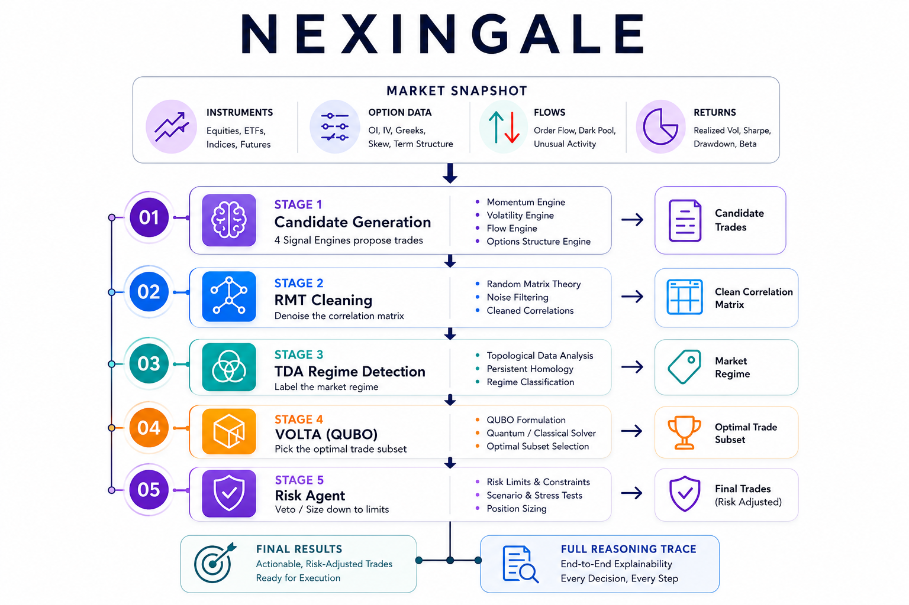

<div align="center">

# NEXINGALE

**A physics-inspired, multi-stage quantitative trading pipeline for Indian derivatives markets.**

Random matrix theory · topological regime detection · Ising/QUBO portfolio selection · rule-based risk

<sub>Research project</sub>

</div>

---

## Introduction

`NEXINGALE` attempts to turn raw market data into a **risk-assessed trade plan**, by
passing it through a five-stage pipeline. The design goal is a system that is both
**rigorous** (every stage grounded in real math, with documented trade-offs) and
**accountable** (every decision is traceable back to the data that produced it).

It is split into two branches that share one spine:

- **Nexingale-D (derivatives)** — dynamic options/futures trading.
- **Nexingale-E (equities)** — long-horizon cross-sectional factor equity trading from exchange filings and other raw data. *To be built.*

This repository currently executes **Nexingale-D**.

> [!WARNING]
>It is a Just for fun research scaffold, not a money-making tool.

---

## Architecture

<p align="center">
  
</p>

<p align="center">
  Workflow from market data input to explainable trades output.
</p>

| Stage | Job | Input | Output |
|------:|-----|-------|--------|
| **1 — Candidates** | propose trade ideas from 4 engines (vol-crush, directional futures, theta-harvest condors, FII/DII flow-follow) | market snapshot | list of candidate trades, each with edge, capital, Greeks, tags |
| **2 — RMT** | strip noise from the correlation matrix | daily returns `(N, T)` | denoised correlation matrix |
| **3 — TDA** | read the market regime from the *shape* of the correlation structure | cleaned matrix | one of `trend / range / sector_rotation / stress` |
| **4 — VOLTA** | choose the best subset of trades under capital, vega, sector & correlation constraints, tilted by regime | candidates + regime + matrix | selected trades |
| **5 — Risk** | enforce hard limits; remove the riskiest trades until the plan is safe | selected trades | approved plan + flags |

---

## The Brief Mathematics: 

Each stage is a real technique, not a heuristic dressed up:

- **Stage 2 — Ledoit-Wolf shrinkage (RMT).** Sample correlation matrices from
  short histories are mostly noise. We shrink the matrix toward a structured
  target by a closed-form, data-driven intensity. It **cannot degenerate** and
  improves the matrix conditioning on every sample (a near-singular matrix with
  condition number ~1e13 becomes ~1e2).
- **Stage 3 — Persistent homology (TDA).** We turn the cleaned correlation into a
  distance, compute its topological features with [`ripser`](https://github.com/scikit-tda/ripser.py),
  and map them to a regime. Different regimes leave different topological
  signatures — often shifting before price-based detectors react.
- **Stage 4 — Ising / QUBO optimisation (VOLTA).** Trade selection is
  combinatorial (2^N subsets). We encode it as a QUBO and solve with simulated
  annealing ([`dimod`](https://github.com/dwavesystems/dimod) +
  [`neal`](https://github.com/dwavesystems/dwave-neal)), with regime-conditional
  edge tilts and a **hard capital-cap repair** so the money limit is never
  violated.
- **Stage 5 — Deterministic risk rules.** No LLM "committee." Hard, auditable
  limits with constraint-targeted size-down. A hook is provided for an optional
  LLM overlay, off by default.

Every place where we chose robustness over mathematical optimality — and the
rigorous upgrade for each — is documented in
[`docs/MATH_LEDGER.md`](docs/MATH_LEDGER.md).

---


## Install

```bash
git clone https://github.com/RestingDarkKnight/quantflow.git
cd quantflow
pip install -e .            # core deps: numpy, dimod, dwave-neal, ripser
pip install pytest          # to run the tests
```

## Quickstart

**Run the bundled demo (single file, no install):**

```bash
pip install numpy dimod dwave-neal ripser
python quantflow_d_standalone.py
```

**Or use the package:**

```python
from quantflow.branches.derivatives import run
from quantflow.branches.derivatives.volta.optimizer import VoltaConfig

market = {
    "universe": ["MARKSANS", "NIFTY", "TRIVENI"],
    # "returns": (N, T) numpy array, optional — enables RMT + TDA
    "events": [
        dict(underlying="MARKSANS", sector="Pharma", expiry="2026-06-26",
             spot=230, iv_percentile=0.72, call_strike=240, put_strike=220,
             est_premium=18000, est_margin=85000, vega_per_lot=-380,
             days_to_event=4),
    ],
    "indices": [
        dict(underlying="NIFTY", expiry="2026-06-26", spot=23000, vix=14.5,
             expected_move=300, wing_width=200, est_credit=9000,
             est_margin=180000, vega_per_lot=-500),
    ],
}

result = run(market, volta_cfg=VoltaConfig(capital_max=1_500_000))
print(result.summary())
```

Sample output:

```
Stage 1 (candidates): 5 proposed
Stage 3 (regime):     trend (conf 0.9)
Stage 4 (VOLTA):      selected 5, net vega -880, capital 668000
Stage 5 (risk):       approved 4/5; cap=583000 vega=-500 delta=80
FINAL PLAN:           4 trades
   - TH00 iron_condor NIFTY edge=5.0% cap=180000  [VIX 14.5, ...]
   ...
FLAGS:
   ! net vega -500 near limit; watch vol expansion
```

## Input format

Each engine reads a list of plain dicts (to be manually entered; a data adapter is
the next feature). 

---

## Project structure

```
quantflow/
├── quantflow/
│   ├── spine/                    # shared across both branches
│   │   ├── rmt/filter.py         # Stage 2: Ledoit-Wolf cleaning
│   │   ├── tda/detect.py         # Stage 3: persistent-homology regime
│   │   ├── memory/               # Stage 1 pattern memory (planned)
│   │   └── data/adapters/        # data ingestion (planned)
│   ├── branches/
│   │   ├── derivatives/          # quantflow-D (built)
│   │   │   ├── candidates/       # Stage 1: signal engines + schema
│   │   │   ├── volta/            # Stage 4: QUBO optimizer
│   │   │   ├── agents/           # Stage 5: risk agent
│   │   │   └── pipeline.py       # orchestrator
│   │   └── equities/             # quantflow-E (planned)
│   └── backtest/                 # (planned — the validation gate)
├── tests/                        # 23 tests
├── docs/
│   ├── STATUS_AND_DEPLOYMENT.md  # workflow + deployment phases
│   └── MATH_LEDGER.md            # robustness-vs-optimality trade-offs
└── quantflow_d_standalone.py     # whole D-pipeline in one runnable file
```

## Tests

```bash
python -m pytest tests/ -q
```

## Followups

1. **Data adapter** — turn Kite / SOVRENN app news / NSE exports into the `market` dict.
2. **Backtest harness** — roll the pipeline over history, score realised P&L /
   Sharpe / drawdown against a benchmark. 
3. **Paper trading** — daily live runs, no orders, for a testing period.
4. **Calibrated edges & trained regime classifier** — replace the hand-formulas after getting a organic trade database.
5. **Nexingale-E** — for equities. 

---

## License

MIT — see [`LICENSE`](LICENSE). *(Change this if you prefer a different license.)*
